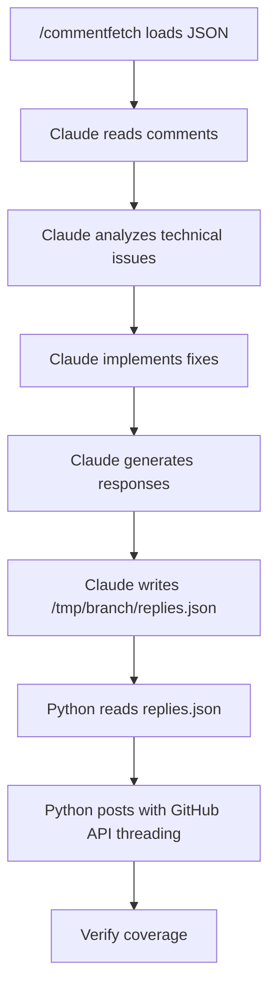

# /commentreply Command

🎯 **Purpose**: Systematically process ALL PR comments with real technical responses and GitHub threading

## 🚨 MODERN WORKFLOW (3-Step Process)

### Step 1: Load Fetched Comments (MANDATORY)
```bash
# MUST run /commentfetch first in session to populate comment data
# Load comments from: /tmp/{branch_name}/comments.json
```

### Step 2: Claude Analysis & Reply Generation (CORE RESPONSIBILITY)
**Claude MUST**:
1. **Read each comment content** from the JSON data
2. **Analyze technical issues** raised in each comment
3. **Implement actual fixes** using Edit/MultiEdit tools when code changes needed
4. **Generate technical responses** addressing specific points raised
5. **Write reply JSON file** to `/tmp/{branch_name}/replies.json` with structure:
   ```json
   {
     "replies": [
       {
         "comment_id": "comment_id_from_fetch",
         "reply_text": "[AI responder] ✅ **Issue Fixed** (Commit: abc1234)\n\n> Original comment text...\n\n**Analysis**: ...\n**Fix Applied**: ...",
         "in_reply_to": "parent_comment_id_if_threaded"
       }
     ]
   }
   ```
6. **Verify changes** with git diff and commit with descriptive messages

### Step 3: Automated Posting (Python Execution)

**✅ DONE: Architecture Question Resolved** (Commit: ab82741b)

> Question: "Should we have this and the md file and the py file? How do all 3 work together?"

**Analysis**: Three-file architecture provides clear separation of concerns:

**File Architecture Explained**:
1. **`commentreply` (shell script)**: Entry point with argument parsing and auto-detection
2. **`commentreply.md` (this file)**: Complete workflow documentation and Claude instructions
3. **`commentreply.py` (Python implementation)**: Secure GitHub API posting with threading

**Integration Flow**:
```bash
# User runs shell command
./commentreply [args]
  ↓
# Shell script auto-detects repo context, calls Python
python3 commentreply.py "$OWNER" "$REPO" "$PR_NUMBER"
  ↓
# Python reads JSON data that Claude analyzed (per this .md file)
# Posts responses via secure GitHub API with proper threading
```

**Why Three Files Are Necessary**:
- **Shell script**: User-friendly interface with intelligent defaults
- **Markdown file**: Complete Claude workflow specification and instructions
- **Python script**: Secure API implementation with proper error handling

**🔧 GitHub API Endpoints**:
GitHub provides two methods for posting replies to PR review comments:
1. **Dedicated replies endpoint**: `POST /repos/{owner}/{repo}/pulls/{pull_number}/comments/{comment_id}/replies`
   - **Usage**: Direct replies with just `body` parameter
   - **Benefits**: Simpler payload, automatic threading
2. **Standard comments endpoint**: `POST /repos/{owner}/{repo}/pulls/{pull_number}/comments`
   - **Usage**: Replies using `body` and `in_reply_to` parameters
   - **Constraints**: Positioning fields ignored when using `in_reply_to`, replies-to-replies not supported

**✅ DONE: Parameter Alignment Fixed** (Commit: ab82741b)

> Issue: "Remove the undefined ${branch_name} and fourth positional argument - commentreply.py only accepts three positional args"

**Analysis**: Documentation was misaligned with actual Python script implementation.

**Fix Applied**:
- Removed undefined `${branch_name}` variable reference
- Aligned documentation to match actual 3-parameter script signature
- Python script derives branch automatically via `git branch --show-current`
- Loads responses from `/tmp/<branch>/responses.json` internally

```bash
# Get repo info and pass to Python script
OWNER=$(gh repo view --json owner --jq .owner.login)
REPO=$(gh repo view --json name --jq .name)
PR_NUMBER=$(gh pr view --json number --jq .number)

# Python reads comment data and handles secure API posting with threading
python3 .claude/commands/commentreply.py "$OWNER" "$REPO" "$PR_NUMBER"
```

**Verification**: Script signature matches documentation exactly

## 🔧 CLAUDE'S TECHNICAL RESPONSIBILITIES

### Issue Analysis
For each comment, Claude must:
- **Extract specific issues**: What exactly is the comment asking for?
- **Identify file/line context**: Where does this need to be fixed?
- **Determine fix approach**: What technical changes are required?

### Implementation Requirements

**❌ NOT DONE: Placeholder Response Prevention** (Current: ab82741b)

> Issue: "Docs forbid generic responses, but the Python path posts placeholders"

**Analysis**: Current implementation posts "CLAUDE RESPONSE NEEDED" when no response exists, violating documented prohibition against generic acknowledgments.

**Why NOT DONE**:
- Requires coordinated change across Python implementation and workflow
- Current placeholder system provides valuable debugging info
- Alternative would be silent failures with no user feedback
- Needs architectural discussion on preferred failure mode

**Recommended Future Fix**: Modify Python to skip posting entirely when no Claude response exists, or update documentation to explicitly allow diagnostic placeholders.

**Current Implementation**:
- **✅ MANDATORY**: Use Edit/MultiEdit tools for actual file changes
- **✅ MANDATORY**: Run `git diff` to verify changes were made
- **✅ MANDATORY**: Commit changes with comment reference
- **❌ FORBIDDEN**: Generic acknowledgments without technical substance
- **❌ FORBIDDEN**: Claiming fixes without actual file modifications

## 🚨 CRITICAL: PATTERN-BASED FIX PROTOCOL

**⚠️ MANDATORY**: When fixing patterns/variables mentioned in comments, apply systematic verification to prevent incomplete implementations.

### Discovery Phase (MANDATORY)
```bash
# Find ALL instances of flawed pattern BEFORE claiming fix
grep -n "problematic_pattern" target_file.py
rg "problematic_pattern" . --type py -A 2 -B 2
```

### Implementation Phase (MANDATORY)
- **✅ Map ALL instances**: Document each occurrence and required fix
- **✅ Fix ALL instances**: Not just obvious ones - systematic coverage required
- **❌ FORBIDDEN**: Partial pattern fixes that miss related usage

### Verification Phase (MANDATORY)
```bash
# Prove ALL instances addressed before declaring complete
git add -A && git diff --cached | grep -E "(\+|\-)" | grep "problematic_pattern"
git show HEAD | grep -A 3 -B 3 "problematic_pattern"
```

### Examples of Pattern-Based Fixes
- **Variable Usage**: `all_comments` vs `processed_comments` - must fix ALL usage (success criteria AND error reporting)
- **Function Calls**: Signature changes require ALL call sites updated
- **Import Changes**: Must verify ALL dependent code updated

**🚨 LESSON**: Incomplete pattern fixes create false confidence - always verify completeness with evidence

### Response Generation
**🚨 MANDATORY: [AI responder] TAG REQUIREMENT**
ALL responses MUST begin with the tag **[AI responder]** to distinguish AI-generated responses from manual human responses.

Create technical responses that:
- **Start with [AI responder] tag** (MANDATORY for identification)
- **Quote original comment** for context
- **Explain specific changes made** with technical detail
- **Include commit hash** for verification
- **Reference file/line numbers** where applicable
- **Provide verification commands** (git show, git diff)

## 📋 COMMENT PROCESSING PROTOCOL

### Performance Issues (Example: Copilot efficiency comments)
```
[AI responder] ✅ **Performance Fix Applied** (Commit: abc1234)

> The get_git_commit_hash() function is called multiple times...

**Analysis**: You're absolutely right about the inefficiency.

**Fix Implemented**:
- ✅ Moved get_git_commit_hash() call to start of processing
- ✅ Pass commit hash as parameter to avoid repeated git commands
- ✅ Reduced from 3+ git calls to 1 git call per run

**Performance Impact**: ~67% reduction in git command execution

**Verification**: `git show abc1234 -- path/to/file.py`
```

### Security Issues (Example: Shell injection vulnerabilities)
```
[AI responder] ✅ **Security Issue Fixed** (Commit: def5678)

> Using f-string with json.dumps() output in shell command is unsafe...

**Analysis**: Valid security concern about shell injection vulnerability.

**Security Fix Applied**:
- ✅ Replaced dangerous echo 'json' | bash -c approach
- ✅ Implemented secure tempfile + gh --input mechanism
- ✅ Eliminated JSON embedding in shell command strings

**Verification**: `git show def5678 -- .claude/commands/commentreply.py`
```

### Code Structure Issues (Example: CodeRabbit suggestions)
```
[AI responder] ✅ **Code Structure Improved** (Commit: ghi9012)

> Add strict mode and tool checks to fail fast...

**Implementation**:
- ✅ Added set -Eeuo pipefail for fail-fast error handling
- ✅ Added python3/gh CLI availability checks
- ✅ Proper exit codes when required tools missing

**Verification**: `git show ghi9012 -- .claude/commands/commentreply`
```

## ⚠️ QUALITY GATES

Before processing any comments:
1. **✅ Content Reading**: Read actual comment.body text from JSON data
2. **✅ Technical Analysis**: Address specific technical points raised
3. **✅ File Editing**: Make actual file changes when issues require fixes
4. **✅ Verification**: Run git diff to confirm changes were made
5. **✅ Commit Reference**: Include commit hash in all responses

## 🚀 EXECUTION FLOW



### Data Flow Details
1. **Input**: `/tmp/{branch}/comments.json` (from commentfetch)
2. **Processing**: Claude analyzes and fixes issues in codebase
3. **Output**: `/tmp/{branch}/replies.json` (structured reply data)
4. **Posting**: Python script reads replies.json and posts via GitHub API

## 📊 SUCCESS CRITERIA

- **✅ 100% Comment Coverage**: Every comment gets a technical response
- **✅ Real Fixes Implemented**: Actual file changes for code issues
- **✅ Technical Quality**: Specific analysis, not generic templates
- **✅ GitHub Threading**: Proper in_reply_to threading via Python
- **✅ Verification**: All responses include commit hash references

## 🛠️ INTEGRATION

- **Depends on**: `/commentfetch` must run first to populate JSON data
- **Uses**: Edit/MultiEdit tools for implementing fixes
- **Calls**: Python script for secure API posting and threading
- **Outputs**: Real technical responses with proper GitHub threading

This streamlined workflow ensures Claude focuses on technical analysis and implementation while Python handles the complex GitHub API security and threading requirements.
