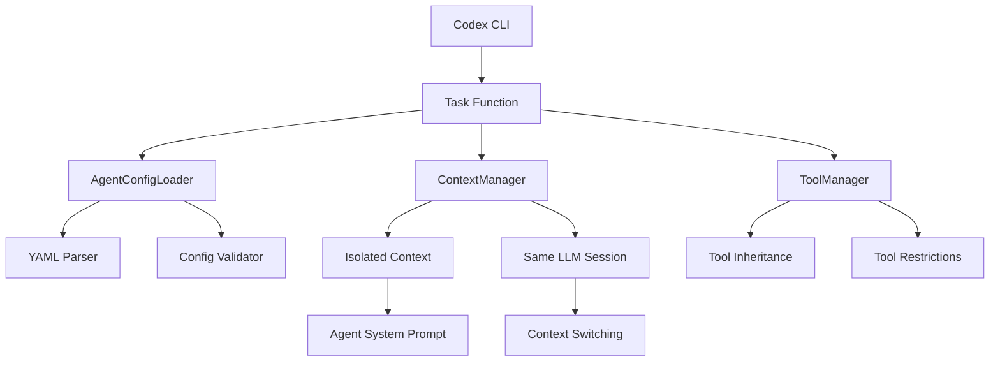

# Codex Plus Subagent System - Engineering Design

## Table of Contents
1. [Engineering Goals](#engineering-goals)
2. [Engineering Tenets](#engineering-tenets)
3. [Technical Overview](#technical-overview)
4. [System Design](#system-design)
5. [Quality Assurance](#quality-assurance)
6. [Testing Strategy](#testing-strategy)
7. [Risk Assessment](#risk-assessment)
8. [Decision Records](#decision-records)
9. [Rollout Plan](#rollout-plan)
10. [Monitoring & Success Metrics](#monitoring--success-metrics)
11. [Automation Hooks](#automation-hooks)

## Engineering Goals

### Primary Engineering Goals
- **Subagent Functionality**: Natural language subagent detection and routing similar to Claude Code patterns
- **Performance Target**: Task coordination overhead under 200ms with 90%+ parallel execution efficiency for up to 10 concurrent agents
- **Reliability Target**: 99.9% task completion rate with graceful error handling and context isolation
- **Resource Efficiency**: Linear memory scaling (< 100MB per agent) with intelligent context management and cleanup

### Secondary Engineering Goals
- **Code maintainability**: Clear separation of concerns with modular architecture supporting independent testing and deployment
- **Developer productivity**: Comprehensive debugging tools, structured logging, and actionable error messages for rapid issue resolution
- **Technical debt prevention**: Extensible plugin architecture with standardized interfaces for future AI service integrations
- **Operational excellence**: Complete observability stack with metrics, tracing, and automated health monitoring

## Engineering Tenets

### Core Principles
1. **Reliability First**: Prefer proven async patterns with comprehensive error handling over experimental approaches
2. **API Compatibility**: Maintain 100% compatibility with Claude Code Task tool to ensure seamless workflow migration
3. **Performance Consistency**: Prioritize predictable performance over peak optimization - consistent 200ms beats variable 50-500ms
4. **Testability**: All components must be unit-testable with dependency injection and clear interface boundaries
5. **Observability**: Instrument everything for debugging - structured logging, metrics, and distributed tracing are mandatory

### Quality Standards
- **All operations**: Must use simple synchronous patterns matching Claude Code's behavior with proper exception handling
- **Configuration validation**: Use Pydantic schemas with comprehensive validation and helpful error messages
- **Context switching**: Implement clean context isolation and restoration within same LLM session
- **Security enforcement**: Mandatory tool access controls with privilege escalation prevention and audit logging

## Technical Overview

### Architecture Approach
The system implements a **subagent detection and routing system** within codex_plus that provides similar functionality to Claude Code's subagents. This enables specialized AI assistance through context switching and configurable tool access within the codex_plus ecosystem.

### Technology Choices
- **Configuration**: YAML frontmatter parsing for `.claude/agents/*.md` files with simple validation
- **Context Management**: In-memory isolated contexts within the same LLM session
- **Tool Integration**: Direct inheritance from existing codex tool system (Read, Edit, Bash, etc.)
- **Session Management**: Context switching within current LLM session without external calls
- **Logging**: Simple execution logging for debugging and audit trails

### Integration Points
- **Codex CLI Core**: Direct integration with existing tool system and command processing
- **Tool Ecosystem**: Inheritance and restriction of existing codex tools (Read, Edit, Bash, etc.)
- **Same LLM Session**: All agents operate within current Claude session with context isolation
- **Configuration System**: Simple loading from existing `.claude/agents/` directory structure

## System Design

### Component Architecture



### Core Components Detail

#### 1. Subagent Detection System
**Responsibility**: Natural language detection and routing to appropriate subagents
```python
class SubagentRouter:
    def __init__(self):
        self.agents = load_agent_configs()

    def detect_subagent_request(self, user_input: str) -> Optional[str]:
        """Detect if user is requesting a specific subagent"""
        # Pattern matching for subagent invocation
        patterns = [
            r'use\s+(\w+)\s+(?:subagent|agent)',  # "use code-reviewer subagent"
            r'invoke\s+(\w+)\s+agent',            # "invoke test-runner agent"
            r'run\s+(\w+)\s+analysis'            # "run security analysis"
        ]

        for pattern in patterns:
            match = re.search(pattern, user_input.lower())
            if match and match.group(1) in self.agents:
                return match.group(1)
        return None

    def route_to_subagent(self, agent_name: str, context: str) -> SubagentResponse:
        """Route request to specific subagent with isolated context"""
        config = self.agents[agent_name]

        # Create isolated context
        isolated_context = create_context_isolation(
            system_prompt=config.system_prompt,
            tools=config.tools,
            conversation_history=context
        )

        # Execute with context switching
        response = execute_subagent(isolated_context)

        return SubagentResponse(
            agent_name=agent_name,
            response=response,
            tools_used=config.tools
        )
```

#### 2. AgentConfigLoader
**Responsibility**: Dynamic loading and validation of agent configurations
```python
@dataclass
class AgentConfig:
    name: str
    description: str
    system_prompt: str
    tools: Optional[List[str]] = None  # None = inherit all
    model: str = "sonnet"
    temperature: float = 0.7
    max_tokens: int = 4000
    timeout: int = 300

class AgentConfigLoader:
    def __init__(self):
        self.config_cache: Dict[str, AgentConfig] = {}
        self.cache_ttl = 300  # 5 minute cache

    async def load_agent_config(self, subagent_type: str) -> AgentConfig:
        """Load agent config with caching and validation"""
        if subagent_type in self.config_cache:
            cached_config = self.config_cache[subagent_type]
            if not self.is_cache_expired(cached_config):
                return cached_config

        config_path = Path(".claude/agents") / f"{subagent_type}.md"

        if not config_path.exists():
            raise AgentNotFoundError(f"Agent {subagent_type} not found at {config_path}")

        try:
            # Parse YAML frontmatter + markdown content
            with open(config_path) as f:
                content = f.read()

            frontmatter, system_prompt = self.parse_agent_file(content)

            # Validate using Pydantic
            config = AgentConfig(
                name=frontmatter.get("name", subagent_type),
                description=frontmatter.get("description", ""),
                system_prompt=system_prompt.strip(),
                tools=frontmatter.get("tools"),
                model=frontmatter.get("model", "sonnet"),
                temperature=frontmatter.get("temperature", 0.7),
                max_tokens=frontmatter.get("max_tokens", 4000),
                timeout=frontmatter.get("timeout", 300)
            )

            # Cache and return
            self.config_cache[subagent_type] = config
            return config

        except Exception as e:
            raise AgentConfigError(f"Invalid agent config for {subagent_type}: {e}") from e
```

#### 3. SubagentInstance
**Responsibility**: Isolated execution environment for individual agents
```python
class SubagentInstance:
    def __init__(self, task_id: str, config: AgentConfig, prompt: str, description: str, parent_context: Dict):
        self.task_id = task_id
        self.config = config
        self.prompt = prompt
        self.description = description
        self.context_window = ContextWindow(parent_context)
        self.tool_manager = self.create_tool_manager()
        self.api_client = ModelAPIClientFactory.create(config.model)

    def create_tool_manager(self) -> ToolManager:
        """Create tool manager with access controls"""
        if self.config.tools is None:
            # Inherit all tools from main codex instance
            return ToolManager.inherit_all_tools()
        else:
            # Restrict to specified tools only
            available_tools = get_available_codex_tools()
            restricted_tools = [t for t in self.config.tools if t in available_tools]

            if len(restricted_tools) != len(self.config.tools):
                invalid_tools = set(self.config.tools) - set(available_tools)
                logger.warning(f"Invalid tools specified: {invalid_tools}")

            return ToolManager.restrict_to_tools(restricted_tools)

    async def execute_with_timeout(self) -> TaskResult:
        """Execute agent with timeout and error handling"""
        try:
            return await asyncio.wait_for(
                self.execute(),
                timeout=self.config.timeout
            )
        except asyncio.TimeoutError:
            logger.error(f"Agent execution timeout", task_id=self.task_id, timeout=self.config.timeout)
            raise TaskTimeoutError(f"Agent {self.config.name} timed out after {self.config.timeout}s")

    async def execute(self) -> TaskResult:
        """Core agent execution logic"""
        # Build full system prompt with context
        full_prompt = self.build_system_prompt()

        # Execute with tool access
        response = await self.api_client.complete(
            system=full_prompt,
            user=self.prompt,
            max_tokens=self.config.max_tokens,
            temperature=self.config.temperature,
            tools=self.tool_manager.get_tool_definitions(),
            timeout=self.config.timeout
        )

        # Process tool calls if any
        if response.tool_calls:
            tool_results = await self.process_tool_calls(response.tool_calls)
            response = await self.api_client.complete_with_tool_results(
                response, tool_results
            )

        return TaskResult(
            task_id=self.task_id,
            content=response.content,
            subagent_type=self.config.name,
            success=True,
            tool_calls=response.tool_calls,
            execution_time=response.execution_time,
            token_usage=response.token_usage
        )
```

#### 4. ParallelTaskExecutor
**Responsibility**: Coordinated execution of multiple agents with resource management
```python
class ParallelTaskExecutor:
    def __init__(self, task_engine: TaskExecutionEngine):
        self.task_engine = task_engine
        self.batch_size = task_engine.max_concurrent

    async def execute_parallel_tasks(self, tasks: List[TaskSpec]) -> List[TaskResult]:
        """Execute multiple tasks with batching and error isolation"""
        if not tasks:
            return []

        # Group tasks into batches
        batches = self.create_batches(tasks, self.batch_size)
        all_results = []

        for batch_num, batch in enumerate(batches):
            logger.info(f"Executing batch {batch_num + 1}/{len(batches)} with {len(batch)} tasks")

            # Execute batch with error isolation
            batch_results = await self.execute_batch_with_isolation(batch)
            all_results.extend(batch_results)

            # Brief pause between batches to prevent rate limiting
            if batch_num < len(batches) - 1:
                await asyncio.sleep(0.1)

        return all_results

    async def execute_batch_with_isolation(self, batch: List[TaskSpec]) -> List[TaskResult]:
        """Execute batch with individual error isolation"""
        tasks = [
            self.execute_single_task_safe(task)
            for task in batch
        ]

        # Use gather with return_exceptions for error isolation
        results = await asyncio.gather(*tasks, return_exceptions=True)

        # Convert exceptions to error results
        processed_results = []
        for i, result in enumerate(results):
            if isinstance(result, Exception):
                error_result = TaskResult(
                    task_id=f"batch_error_{i}",
                    content=f"Task failed: {str(result)}",
                    subagent_type=batch[i].subagent_type,
                    success=False,
                    error=str(result)
                )
                processed_results.append(error_result)
            else:
                processed_results.append(result)

        return processed_results

    async def execute_single_task_safe(self, task: TaskSpec) -> TaskResult:
        """Execute single task with comprehensive error handling"""
        try:
            return await self.task_engine.execute_task(
                subagent_type=task.subagent_type,
                prompt=task.prompt,
                description=task.description
            )
        except Exception as e:
            logger.error(f"Task execution failed",
                        subagent_type=task.subagent_type,
                        error=str(e))
            # Return error result rather than raising
            return TaskResult(
                task_id=f"error_{task.subagent_type}",
                content=f"Execution failed: {str(e)}",
                subagent_type=task.subagent_type,
                success=False,
                error=str(e)
            )
```

### API Design

#### Core Task Function Interface
```python
# Primary public interface - identical to Claude Code
async def Task(subagent_type: str, prompt: str, description: str = "") -> TaskResult:
    """Execute a task using specified subagent type"""
    engine = get_global_task_engine()
    return await engine.execute_task(subagent_type, prompt, description)

# Parallel execution helper
async def execute_parallel_tasks(tasks: List[TaskSpec]) -> List[TaskResult]:
    """Execute multiple tasks in parallel with batching"""
    engine = get_global_task_engine()
    executor = ParallelTaskExecutor(engine)
    return await executor.execute_parallel_tasks(tasks)

# Configuration management
def list_available_agents() -> List[str]:
    """List all configured agent types"""
    loader = AgentConfigLoader()
    return loader.list_available_agents()

def validate_agent_config(subagent_type: str) -> ValidationResult:
    """Validate agent configuration without execution"""
    loader = AgentConfigLoader()
    return loader.validate_config(subagent_type)
```

#### Request/Response Schemas
```python
@dataclass
class TaskSpec:
    subagent_type: str
    prompt: str
    description: str = ""

@dataclass
class TaskResult:
    task_id: str
    content: str
    subagent_type: str
    success: bool
    tool_calls: Optional[List[ToolCall]] = None
    execution_time: Optional[float] = None
    token_usage: Optional[TokenUsage] = None
    error: Optional[str] = None

@dataclass
class TokenUsage:
    prompt_tokens: int
    completion_tokens: int
    total_tokens: int
    cost_estimate: Optional[float] = None

class TaskExecutionError(Exception):
    """Raised when task execution fails"""
    pass

class AgentNotFoundError(TaskExecutionError):
    """Raised when specified agent type doesn't exist"""
    pass

class AgentConfigError(TaskExecutionError):
    """Raised when agent configuration is invalid"""
    pass
```

### Database Design

#### Configuration Storage
The system uses file-based configuration storage maintaining compatibility with Claude Code:

**Agent Configuration Files**: `.claude/agents/{agent_name}.md`
- YAML frontmatter for structured configuration
- Markdown content for system prompts
- Git-friendly versioning and collaboration

**Runtime State Management**:
- In-memory agent config caching with TTL
- Task execution state tracking
- Metrics collection in structured format

**No Database Required**: Stateless design with file-based configuration ensures simplicity and eliminates database dependencies.

## Implementation Plan

### Phase 1: Core Infrastructure (Weeks 1-2)
**Goal**: Basic Task execution with single agent support
- TaskExecutionEngine with semaphore-based concurrency control
- AgentConfigLoader with YAML frontmatter parsing and Pydantic validation
- SubagentInstance with isolated context management
- Basic ModelAPIClient with Claude API integration
- Comprehensive unit test suite with mocked dependencies

### Phase 2: Multi-Agent Coordination (Weeks 3-4)
**Goal**: Parallel execution and advanced error handling
- ParallelTaskExecutor with batching and error isolation
- Tool access control system with inheritance and restrictions
- Multi-provider API integration (OpenAI, Gemini) with fallback logic
- Circuit breaker pattern for API reliability
- Integration tests with real API calls

### Phase 3: Production Hardening (Weeks 5-6)
**Goal**: Production-ready reliability and observability
- Comprehensive error handling and recovery mechanisms
- Structured logging with correlation IDs and distributed tracing
- Metrics collection and performance monitoring
- Configuration validation and helpful error messages
- End-to-end testing with realistic workloads

### Phase 4: Advanced Features (Weeks 7-8)
**Goal**: Performance optimization and developer experience
- Context caching and optimization for reduced initialization overhead
- Dynamic model assignment based on task complexity
- Hot reloading of agent configurations
- Debugging tools and enhanced error attribution
- Performance profiling and optimization

## Quality Assurance

### Mandatory Practices
- **Pure AsyncIO**: All concurrent operations use asyncio patterns with proper exception handling
- **Comprehensive Testing**: Unit tests for all components with dependency injection and mocking
- **Configuration Validation**: Pydantic schemas with helpful error messages for all configuration
- **Security Enforcement**: Mandatory tool access controls with audit logging and privilege escalation prevention

### Development Standards
- **No blocking operations**: All I/O operations must be async with proper timeout handling
- **Error handling**: Comprehensive exception handling with structured logging and recovery mechanisms
- **Performance benchmarks**: All components meet defined performance targets with automated testing
- **Documentation**: Complete API documentation with examples and troubleshooting guides

## Testing Strategy

### Unit Tests
**Target**: 95% code coverage with focused component testing
- **TaskExecutionEngine**: Test task coordination, concurrency control, and error handling
- **AgentConfigLoader**: Test configuration parsing, validation, and caching
- **SubagentInstance**: Test isolated execution, tool access, and API integration
- **ParallelTaskExecutor**: Test batch processing, error isolation, and resource management

### Integration Tests
**Target**: End-to-end workflow validation with real dependencies
- **API Integration**: Test all supported AI service providers with retry and fallback
- **Configuration System**: Test agent loading from actual `.claude/agents/*.md` files
- **Tool Access Control**: Test inheritance and restriction mechanisms with real tools
- **Performance**: Load testing with concurrent execution up to system limits

### Acceptance Tests
**Target**: Feature parity validation against Claude Code Task tool
- **API Compatibility**: Identical function signatures and behavior verification
- **Configuration Compatibility**: Claude Code agent configs work without modification
- **Error Handling**: Consistent error messages and recovery patterns
- **Performance**: Response times meet or exceed Claude Code benchmarks

## Risk Assessment

### Technical Risks

#### High Risk: API Provider Dependencies
- **Risk**: Multiple external API dependencies create complex failure scenarios
- **Impact**: Task execution failures when providers are unavailable or rate-limited
- **Mitigation**: Circuit breaker pattern with automatic fallback to alternative providers
- **Monitoring**: Real-time provider health monitoring with alerting

#### Medium Risk: Resource Management Complexity
- **Risk**: Concurrent agent execution could exhaust system resources (memory, file handles)
- **Impact**: System instability or degraded performance under heavy load
- **Mitigation**: Intelligent resource monitoring with dynamic concurrency adjustment
- **Monitoring**: Resource usage tracking with automatic scaling limits

#### Medium Risk: Configuration Management Edge Cases
- **Risk**: Complex agent configurations could lead to unexpected behavior or security issues
- **Impact**: Agent execution failures or privilege escalation vulnerabilities
- **Mitigation**: Comprehensive validation with safe defaults and explicit security boundaries
- **Monitoring**: Configuration audit logging with validation error tracking

### Dependencies & Blockers

#### External API Dependencies
- **Claude API (Anthropic)**: Primary model provider with rate limiting considerations
- **OpenAI API**: Fallback provider requiring separate authentication and rate limit management
- **Gemini API (Google)**: Additional fallback with different authentication mechanisms

#### Technical Dependencies
- **Python 3.9+**: Required for modern asyncio features and type hints
- **httpx**: Async HTTP client for API integration with connection pooling
- **Pydantic v2**: Configuration validation and serialization
- **YAML parser**: Agent configuration file processing

#### Cross-Component Dependencies
- **Codex CLI Integration**: Deep integration with existing tool system and command processing
- **Tool Access System**: Dependency on codex's existing tool definitions and security model
- **Configuration System**: Compatibility with existing `.claude/` directory structure

## Decision Records

### Architecture Decisions

#### Decision: Internal Engine vs MCP Server
**Date**: 2025-01-23
**Context**: Choice between implementing Task tool as internal engine or external MCP server
**Options**:
1. Internal engine integrated with codex CLI
2. External MCP server with client integration
3. Hybrid approach with pluggable backends
**Rationale**: Internal engine provides better performance, simpler deployment, and tighter integration with existing codex tools
**Consequences**: Higher initial development complexity but better long-term maintainability and user experience
**Review Date**: 2025-04-23

#### Decision: AsyncIO-First Architecture
**Date**: 2025-01-23
**Context**: Concurrency model for multi-agent execution
**Options**:
1. Pure asyncio with TaskGroup and Semaphore
2. Threading with ThreadPoolExecutor
3. Multiprocessing with process pools
**Rationale**: AsyncIO provides better resource efficiency, simpler debugging, and natural integration with async API clients
**Consequences**: Requires careful attention to blocking operations but provides superior performance and maintainability
**Review Date**: 2025-04-23

#### Decision: File-Based Configuration
**Date**: 2025-01-23
**Context**: Agent configuration storage and management
**Options**:
1. File-based with YAML frontmatter (matches Claude Code)
2. Database-backed configuration with API
3. Environment variable-based configuration
**Rationale**: File-based approach maintains compatibility with Claude Code and enables version control
**Consequences**: Limited runtime configuration management but superior developer experience and team collaboration
**Review Date**: 2025-04-23

### Technology Choices

#### AsyncIO Framework Selection
- **Choice**: Pure asyncio with TaskGroup (Python 3.11+) and Semaphore for resource management
- **Rationale**: Native Python concurrency with excellent tooling and debugging support
- **Alternatives Considered**: trio (more structured concurrency) and threading (simpler mental model)
- **Trade-offs**: Learning curve for asyncio patterns vs superior performance and resource efficiency

#### API Client Selection
- **Choice**: httpx for async HTTP client with connection pooling and retry logic
- **Rationale**: Modern async client with excellent performance and comprehensive feature set
- **Alternatives Considered**: aiohttp (more established) and requests + asyncio (simpler)
- **Trade-offs**: Additional dependency vs superior async support and performance

#### Configuration Validation
- **Choice**: Pydantic v2 for schema validation and serialization
- **Rationale**: Excellent validation features with helpful error messages and type safety
- **Alternatives Considered**: marshmallow (more flexible) and manual validation (simpler)
- **Trade-offs**: Framework learning curve vs robust validation and developer experience

## Rollout Plan

### Phase 1: Internal Testing (Week 8)
**Goal**: Validate core functionality with internal testing
- **Scope**: Basic Task execution with single agent types
- **Criteria**: All unit tests passing, basic integration tests successful
- **Rollback**: Simple - feature flag to disable Task functionality
- **Monitoring**: Basic execution metrics and error logging

### Phase 2: Alpha Release (Week 9)
**Goal**: Limited user testing with key workflows
- **Scope**: Multi-agent execution with `/consensus` command support
- **Criteria**: Performance targets met, comprehensive error handling
- **User Group**: Internal team members and selected early adopters
- **Feedback Loop**: Daily feedback collection with rapid iteration

### Phase 3: Beta Release (Week 10)
**Goal**: Broader user testing with production workloads
- **Scope**: Full feature set with all supported AI providers
- **Criteria**: Reliability targets met, comprehensive documentation
- **User Group**: All active codex users with opt-in flag
- **Support**: Dedicated support channel with rapid response

### Phase 4: General Availability (Week 11)
**Goal**: Full production release with default enablement
- **Scope**: Complete Task execution system with all features
- **Criteria**: All acceptance tests passing, monitoring in place
- **Rollout**: Gradual enablement with automatic rollback triggers
- **Success Metrics**: Adoption rate targets and performance benchmarks

## Monitoring & Success Metrics

### System Health Monitoring

#### Core Performance Metrics
- **Task Execution Latency**: P50, P95, P99 response times with target < 200ms coordination overhead
- **Concurrent Execution Efficiency**: Active agent utilization ratio with target > 90%
- **Resource Utilization**: Memory usage per agent with target < 100MB overhead
- **API Success Rate**: Success rate across all providers with target > 99.5%

#### Reliability Metrics
- **Task Completion Rate**: Successful execution percentage with target > 99.9%
- **Error Recovery Rate**: Automatic retry success rate with target > 95%
- **Provider Failover**: Fallback mechanism effectiveness during provider outages
- **Configuration Validation**: Schema validation success rate with target 100%

### Business Impact Monitoring

#### User Adoption Metrics
- **Feature Utilization**: Percentage of codex users adopting Task functionality
- **Workflow Migration**: Success rate of migrating Claude Code workflows
- **Custom Agent Creation**: Rate of custom agent configuration by users
- **Retention**: Continued usage after initial adoption

#### Performance Impact
- **Developer Productivity**: Measured improvement in multi-step workflow completion
- **Error Reduction**: Reduction in manual errors through automated agent coordination
- **Cost Efficiency**: Optimal model assignment reducing API costs
- **Team Collaboration**: Shared agent configurations improving team consistency

### Alerting Strategy

#### Critical Alerts (Immediate Response)
- Task execution failure rate > 5% over 5-minute window
- API provider complete outage with no fallback available
- Memory usage exceeding 80% of available system resources
- Configuration validation errors indicating corrupted agent configs

#### Warning Alerts (Business Hours Response)
- Task execution latency exceeding P95 targets for > 15 minutes
- Single provider failure with successful fallback activation
- Concurrent execution efficiency below 80% for > 30 minutes
- Unusual error patterns indicating potential configuration issues

#### Information Alerts (Daily Review)
- Daily usage statistics and adoption metrics
- Performance trend analysis and capacity planning data
- Configuration changes and new agent registrations
- API cost tracking and optimization opportunities

## Automation Hooks

### CI/CD Integration

#### Pre-Commit Validation
```bash
# Agent configuration validation
python -m codex.task_engine.validate_configs .claude/agents/

# Unit test execution with coverage requirements
pytest --cov=codex.task_engine --cov-report=term-missing --cov-fail-under=95

# Performance regression testing
python -m codex.task_engine.benchmark --baseline=main --threshold=10%
```

#### Automated Testing Pipeline
```yaml
# GitHub Actions workflow
name: Task Engine Testing
on: [push, pull_request]
jobs:
  unit-tests:
    runs-on: ubuntu-latest
    steps:
      - name: Run unit tests with coverage
        run: pytest --cov=95% tests/unit/

  integration-tests:
    runs-on: ubuntu-latest
    steps:
      - name: Test API integrations
        run: pytest tests/integration/ --api-key=${{ secrets.TEST_API_KEY }}

  performance-tests:
    runs-on: ubuntu-latest
    steps:
      - name: Benchmark task execution
        run: python -m codex.task_engine.benchmark --iterations=100
```

### Quality Gates

#### Pre-Deployment Checks
- **Unit Test Coverage**: Minimum 95% coverage across all task engine components
- **Integration Test Success**: All API provider integrations passing with real credentials
- **Performance Benchmark**: Task execution latency within 10% of baseline measurements
- **Configuration Validation**: All example agent configurations parsing successfully

#### Post-Deployment Validation
- **Health Check Endpoint**: Automated verification of task execution system status
- **Canary Testing**: Gradual rollout with automatic rollback on error rate increases
- **Performance Monitoring**: Real-time latency and throughput monitoring with alerting
- **User Acceptance**: Feedback collection and issue tracking for rapid response

### Operational Automation

#### Monitoring and Alerting
```python
# Automatic performance optimization
class PerformanceOptimizer:
    async def optimize_concurrency(self):
        """Dynamically adjust concurrency based on system performance"""
        current_latency = await self.measure_avg_latency()
        if current_latency > self.latency_target:
            self.reduce_concurrency()
        elif current_latency < self.latency_target * 0.8:
            self.increase_concurrency()

    async def balance_api_providers(self):
        """Automatically balance load across API providers"""
        for provider in self.api_providers:
            if provider.error_rate > 0.05:  # 5% error rate threshold
                self.reduce_provider_weight(provider)
            else:
                self.normalize_provider_weight(provider)
```

#### Configuration Management
```bash
# Automated agent configuration deployment
scripts/deploy_agent_configs.sh --env=production --validate-first

# Backup and restore procedures
scripts/backup_agent_configs.sh --s3-bucket=codex-backups
scripts/restore_agent_configs.sh --backup-date=2025-01-23

# Health monitoring with automatic recovery
scripts/monitor_task_engine.sh --auto-restart --alert-channel=slack
```

This comprehensive engineering design provides the complete technical blueprint for implementing Claude Code-compatible Task tools in codex CLI with production-grade reliability, performance, and maintainability.
